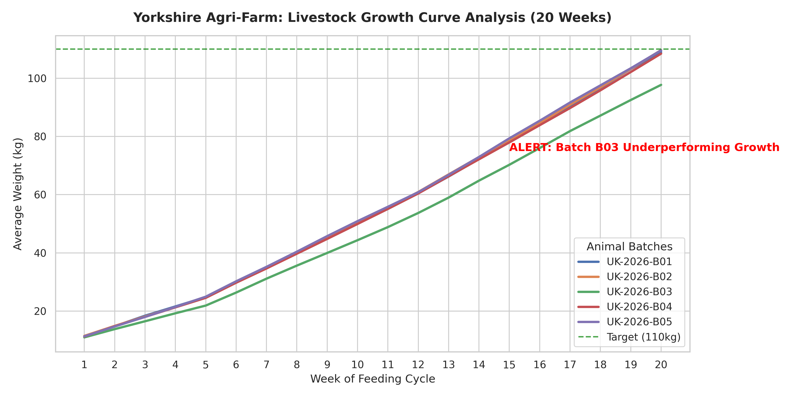

# Yorkshire Agri-Analytics: Production Performance Project

## 📌 Project Overview
This data analytics project evaluates and optimizes production performance metrics for a commercial pig-farming facility (**Yorkshire Agri-Farm Ltd**) based in North Yorkshire, UK. 

The project builds an end-to-end data pipeline to monitor livestock growth dynamics, track feed consumption expenses, and automatically detect underperforming animal batches to protect profit margins during the UK agricultural cost crisis.

---

## 💼 Business Challenge & KPIs
Feed costs constitute up to 70% of total production expenses in livestock farming. This project delivers automated insights to farm technologists and executives using two core agricultural metrics:
* **Average Daily Gain (ADG):** Tracks the daily weight increase (target growth from 8kg to ~110kg over a 20-week cycle).
* **Feed Conversion Ratio (FCR):** Measures feed efficiency (KG of feed required to produce 1KG of live weight). A high FCR signifies massive financial waste.

---

## 🛠️ Tech Stack & Data Architecture
The pipeline processes raw data and migrates it into a structured enterprise environment:
1. **Python (Pandas):** Used for data ingestion, cleaning daily tracking logs, and calculating core KPIs.
2. **PostgreSQL:** Serves as the robust, centralized data warehouse where cleaned tables are hosted (`batches`, `weight_logs`, `feed_logs`).
3. **SQL (Advanced Queries):** Used within PostgreSQL to write multi-table aggregate `JOIN` queries for automated anomaly detection.
4. **Matplotlib & Seaborn:** Used to visualize the live growth curves directly from the database.

---

## 🕵️‍♂️ Advanced SQL & Analytical Insights
By writing optimized SQL scripts with relational `JOIN`s and `GROUP BY` aggregations, the pipeline successfully isolated a major biological/operational issue in the system.

### Key Finding:
* While standard batches (**B01, B02, B04, B05**) performed perfectly within the UK benchmark of a **2.60 FCR**, **Batch UK-2026-B03** demonstrated a severe efficiency drop, spiking to an alarming **3.10 FCR**.
* **Financial Impact:** This single anomaly resulted in an overconsumption of **9,645 kg of feed**, costing the farm approximately **£3,375 in wasted expenses**, combined with a significant market-value penalty as the animals finished 12kg under weight targets.

---

## 📊 Visualisation: Livestock Growth Curve
The chart below, generated via Python directly from the PostgreSQL backend, clearly illustrates the 20-week trajectory. Notice how the red alert line for Batch B03 significantly sags below the baseline and misses the 110kg market-ready target:

---

## 🚀 How to Run Local Environment
1. Clone this repository to your Linux environment.
2. Install dependencies: `pip install pandas sqlalchemy psycopg2-binary matplotlib seaborn`.
3. Generate raw data: `python generate_farm_data.py`.
4. Migrate data to your local PostgreSQL server: `python save_to_postgres.py` (ensure your connection URI is updated).
5. Run the analytics window: `python plot_farm_perf.py`.